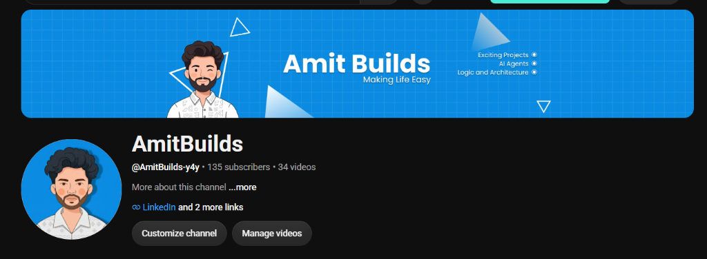
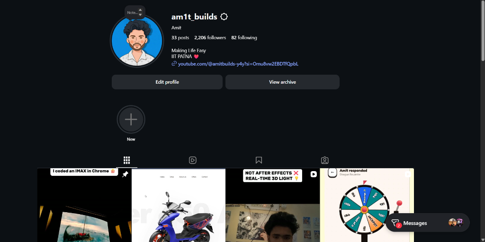

<div align="center">

# 🚀 Amit Builds (`am1t_builds`)

### *Creative Engineering • Computer Vision • AI Agents • Interactive 3D Web*

[](https://www.youtube.com/@AmitBuilds-y4y)
[](https://www.instagram.com/am1t_builds/?hl=en)
[](https://github.com/)
[](https://github.com/)

<br/>

> **"Making Life Easy through Creative Engineering, Computer Vision, AI Automations, and Interactive 3D Graphics."**

</div>

---

## 📺 About The Channel & This Repository

On my [**YouTube Channel (@AmitBuilds-y4y)**](https://www.youtube.com/@AmitBuilds-y4y) and [**Instagram Page (@am1t_builds)**](https://www.instagram.com/am1t_builds/?hl=en), I create fast-paced, entertaining short videos demonstrating quirky, problem-solving, and cutting-edge software experiments — without getting lost in dry technical slides.

**This monorepo is the official codebase for all the projects featured across my channels.** If you saw a project in a reel or video and wanted to know how it actually works under the hood, run it locally, or modify it for yourself — you’ve come to the right place!

<div align="center">

### 🎬 Channel Previews

| 🔴 **YouTube Channel** ([@AmitBuilds-y4y](https://www.youtube.com/@AmitBuilds-y4y)) |
| :---: |
| [](https://www.youtube.com/@AmitBuilds-y4y) |

| 📸 **Instagram Community** ([@am1t_builds](https://www.instagram.com/am1t_builds/?hl=en)) |
| :---: |
| [](https://www.instagram.com/am1t_builds/?hl=en) |

</div>

---

## 🗂️ Showcase of Sub-Projects

Every folder in this repository is an independent, self-contained project with its own dependencies and logic. Here is the complete catalog of builds:

```
am1t_builds/
├── 👁️ Computer Vision & HCI
│   ├── Desk Touchpad/                 # AI desk-surface multi-touch trackpad
│   ├── Palm touchpad/                 # Floating rotation-invariant palm trackpad
│   ├── Hand Gesture PC Controller/    # Contactless gesture & eye-gaze PC control
│   └── Eye-Gaze Reel Controller/      # Hands-free eye-tracking reel scroller
├── 🎨 3D Graphics, WebGL & Experiences
│   ├── 3D Theater Webplayer/          # 3D IMAX cinema player with 5.1 surround sound
│   ├── 3D-Github-Galaxy/              # Interactive 3D planetary galaxy of GitHub repos
│   ├── Virtual Light/                 # Monocular depth AI + WebGL2 live video lighting
│   ├── Meme Hologram/                 # 3D holographic particle cloud video visualizer
│   ├── Birthday Gift/                 # 3D memory museum with mic candle-blowing mechanic
│   └── independence day vip card/     # Holographic 3D Tiranga collector's pass
├── 🤖 AI Agents & Voice Architectures
│   ├── Zero-Keystroke Voice Architect/# Voice-driven autonomous AI agent coding bridge
│   └── Sketch to Website/             # AI agent turning hand-drawn sketches into React apps
├── ⚡ Anti-Procrastination & Savage Bots
│   ├── DoomScrollPunsiher/            # AI monitor that roasts & kills browser on doomscrolling
│   ├── The Anti-Doomscroll Saboteur/  # Punishment bot that auto-likes ex's posts on overtime
│   └── debtCollector/                 # Selenium bot that auto-comments debt recovery reminders
└── 🔍 Auditors, Parsers & Web Tools
    ├── Website Cloner/                # Playwright zero-AI perfect website scraper & packager
    ├── GithubAuditor/                 # Brutally honest Hindi roast engine for GitHub profiles
    └── FriendGroupAudit/              # WhatsApp chat analyzer & toxic friendship roast engine
```

---

### 👁️ 1. Computer Vision & Human-Computer Interfaces (HCI)

| Project | The Crust (What It Does) | Tech Stack |
| :--- | :--- | :--- |
| **[`Desk Touchpad`](./Desk%20Touchpad)** | Turns any regular desk surface into a high-precision multi-touch laptop trackpad using a webcam/smartphone camera and MediaPipe landmark tracking. Supports taps, multi-finger clicks, scrolling, and dragging. | `Python`, `MediaPipe`, `OpenCV`, `PyAutoGUI` |
| **[`Palm touchpad`](./Palm%20touchpad)** | Uses the left palm as a floating, rotation-invariant virtual trackpad using mathematical change-of-basis, while the right index finger acts as the cursor with pinch-to-click detection. | `Python`, `MediaPipe Tasks`, `NumPy`, `PyAutoGUI` |
| **[`Hand Gesture PC Controller`](./Hand%20Gesture%20PC%20Controller)** | An intelligent contactless PC control system that allows complete navigation, window switching, scrolling, and media control using intuitive hand gestures and facial tracking. | `Python`, `MediaPipe`, `OpenCV`, `PyAutoGUI` |
| **[`Eye-Gaze Reel Controller`](./Eye-Gaze%20Reel%20Controller)** | Hands-free short-form video controller (Instagram Reels, YouTube Shorts, TikTok). Look up to go to the next reel, look down to replay, and wink to like without lifting a finger. | `Python`, `MediaPipe FaceMesh`, `OpenCV` |

---

### 🎨 2. 3D Graphics, WebGL & Interactive Experiences

| Project | The Crust (What It Does) | Tech Stack |
| :--- | :--- | :--- |
| **[`3D Theater Webplayer`](./3D%20Theater%20Webplayer)** | A fully rendered 3D IMAX cinema experience in your browser. Streams MKV/MP4 files, extracts 5.1 surround sound mapped spatially to 3D theater speakers via Web Audio API, and renders 3D subtitles. | `Three.js`, `Node.js`, `Web Audio API`, `FFmpeg` |
| **[`3D-Github-Galaxy`](./3D-Github-Galaxy)** | Transforms any GitHub profile into an interactive 3D procedural solar system and galaxy where repositories are glowing stars, links form constellations, and ambient synth audio plays. | `Next.js 14`, `Three.js`, `GSAP`, `Tailwind CSS` |
| **[`Virtual Light`](./Virtual%20Light)** | A draggable 3D point light that lives *inside* your live webcam feed! Uses client-side ONNX monocular depth estimation to calculate distance and a WebGL2 shader to relight you in real time. | `WebGL2`, `Transformers.js`, `ONNX`, `Vite` |
| **[`Meme Hologram`](./Meme%20Hologram)** | An interactive particle visualizer that converts video frames into millions of dancing 3D holographic point clouds with depth modulation and audio responsiveness. | `Three.js`, `Vite`, `GLSL Shaders` |
| **[`Birthday Gift`](./Birthday%20Gift)** | An interactive 3D memory museum walking through memories and photos in a virtual art gallery, ending with a 3D birthday cake where blowing into the phone's microphone extinguishes the candles. | `Three.js`, `Vite`, `Web Audio API` |
| **[`independence day vip card`](./independence%20day%20vip%20card)** | A futuristic holographic 3D digital Tiranga pass generator with interactive lighting, engraved user photo, dynamic particle systems, and collector badge styling. | `HTML5 Canvas`, `WebGL`, `CSS 3D` |

---

### 🤖 3. AI Agents, Voice & LLM Automation

| Project | The Crust (What It Does) | Tech Stack |
| :--- | :--- | :--- |
| **[`Zero-Keystroke Voice Architect`](./Zero-Keystroke%20Voice%20Architect)** | A voice-to-code bridge connecting speech recognition to autonomous multi-agent software engineering workflows (Antigravity CLI / AI Agents), complete with a live real-time dashboard and sound effects. | `Python`, `Faster-Whisper`, `WebSocket`, `Web UI` |
| **[`Sketch to Website`](./Sketch%20to%20Website)** | Draws on paper or digital canvas? Snap a picture of a rough hand-drawn UI sketch and this AI pipeline converts it into clean, production-ready React (Vite) components with zero manual coding. | `React`, `Vite`, `Node.js`, `Vision LLMs` |

---

### ⚡ 4. Productivity, Anti-Procrastination & Savage Bots

| Project | The Crust (What It Does) | Tech Stack |
| :--- | :--- | :--- |
| **[`DoomScrollPunsiher`](./DoomScrollPunsiher)** | A ruthless background productivity guardian. When you open social media, it takes a screenshot, gets Gemini AI to generate a toxic manager roast, kills your browser, sounds an alarm, and speaks the roast via TTS. | `Python`, `Google Gemini AI`, `pyttsx3`, `Tkinter` |
| **[`The Anti-Doomscroll Saboteur`](./The%20Anti-Doomscroll%20Saboteur)** | Floating timer widget that counts down your Instagram reel time. If you exceed the limit, it jerks your cursor, boots an automated browser session, and auto-likes embarrassing old posts on a designated target profile. | `Python`, `Selenium`, `PyAutoGUI`, `Tkinter` |
| **[`debtCollector`](./debtCollector)** | Automated Instagram recovery bot. Parses a list of debtor friends who owe you money, navigates to their latest Instagram posts via Selenium, and automatically leaves comments reminding them to pay you back. | `Python`, `Selenium`, `Chrome WebDriver` |

---

### 🔍 5. Auditors, Scrapers & Reverse Engineering

| Project | The Crust (What It Does) | Tech Stack |
| :--- | :--- | :--- |
| **[`Website Cloner`](./Website%20Cloner)** | Ultra-fast zero-AI website harvester. Uses Playwright to capture raw pristine DOM, external styles, computed assets, and inlined resources, packaging target websites into standalone deployable bundles. | `Node.js`, `Playwright`, `Express` |
| **[`GithubAuditor`](./GithubAuditor)** | A client-side React auditor that inspects any developer's GitHub profile metrics (commit consistency, PRs, repos) and generates a hilarious, brutally honest roast in Hindi. | `React`, `Vite`, `Tailwind CSS`, `GitHub API` |
| **[`FriendGroupAudit`](./FriendGroupAudit)** | Upload a WhatsApp group chat export `.txt` file to receive a data-driven roast ranking friends on response delays, dry texting, ghosting rates, and late-night activity. | `JavaScript (Vanilla)`, `HTML5/CSS3`, `Regex` |

---

## 🚀 Getting Started

To explore or run any of the projects locally:

### 1. Clone the repository
```bash
git clone https://github.com/amitsikdar37/am1t_builds.git
cd am1t_builds
```

### 2. Navigate to the desired project directory
```bash
# Example: Running the 3D IMAX Theatre Webplayer
cd "3D Theater Webplayer"
npm install
npm run start
```
```bash
# Example: Running the Desk Touchpad AI
cd "Desk Touchpad"
pip install -r requirements.txt
python desk_touchpad.py
```

> 💡 **Note:** Each individual folder contains its own specific `README.md` or configuration guide with one-time setup steps (e.g., API keys, dependencies, webcam permissions).

---

## 🌐 Connect With Amit Builds

If you like these projects or have an idea for a wild new build, let's connect!

- 🔴 **YouTube:** [@AmitBuilds-y4y](https://www.youtube.com/@AmitBuilds-y4y) — *Longer breakdowns, setup tutorials & tech deep-dives*
- 📸 **Instagram:** [@am1t_builds](https://www.instagram.com/am1t_builds/?hl=en) — *Short-form reels, live project demos & behind-the-scenes*

---

<div align="center">

⭐ **If you found any of these projects fun or useful, consider starring this repo!** ⭐

Made with ❤️ by [Amit](https://www.instagram.com/am1t_builds/?hl=en)

</div>
